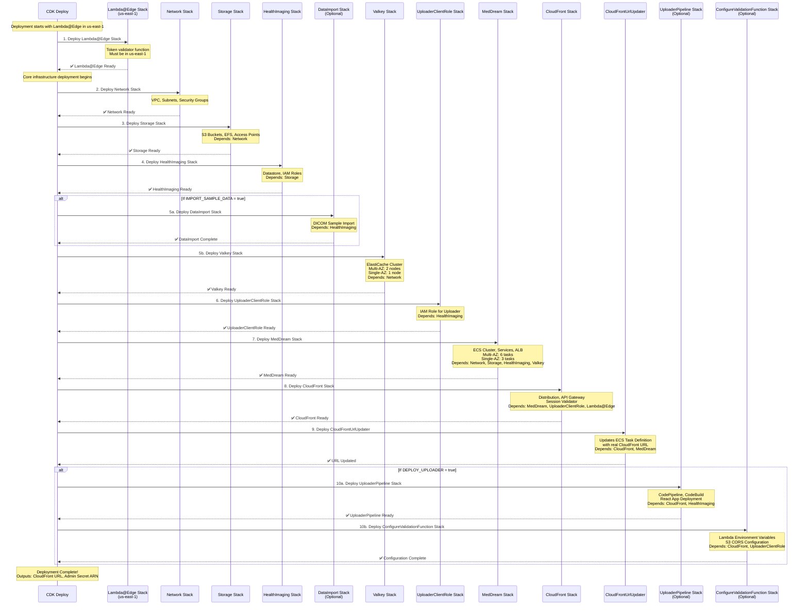

# AWS HealthImaging DICOM Viewer and Uploader

A secure, scalable solution for viewing and uploading DICOM medical images using MedDream viewer, AWS HealthImaging, and a custom React-based uploader interface.

This project provides a complete infrastructure for medical imaging workflows, combining AWS HealthImaging for DICOM image storage and management with MedDream's powerful viewer capabilities. The solution includes a custom uploader interface that enables secure, validated file uploads directly to AWS HealthImaging.

The system features serverless authentication, Valkey-based session management, and CloudFront distribution for optimal performance. It supports multi-AZ deployment for high availability and includes comprehensive security controls through IAM roles and security groups.

## Architecture


## ⚠️READ this section if this project is intended to be used in production.

⚠️ This CDK project deploys the MedDream application behind CloudFront using an HTTP connection to the MedDream application load balancer. This choice was made for the sake of easily testing the solution without complexities related to domain name and TLS certificate configurations. By default the communication between CloudFront and the MedDream Application load balancer results in the exchange of unencrypted data over the public network. 

If this project is intended to be used in production, make sure that the project is reconfigured with the following production-ready settings:

## **1. Enable Multi-AZ Deployment for High Availability**

For production environments, enable Multi-AZ mode to ensure high availability and fault tolerance:

```typescript
// In infrastructure/bin/cdk.ts
const ENABLE_MULTI_AZ = true;  // Enable for production
```

**Multi-AZ Production Benefits:**
- **High Availability**: ECS tasks distributed across multiple Availability Zones
- **Automatic Failover**: Valkey cluster with primary and replica nodes
- **Data Protection**: EFS automatic backups enabled
- **Fault Tolerance**: Service continues running if one AZ becomes unavailable

## **2. Configure HTTPS Between CloudFront and Load Balancer**

Reconfigure the project to use HTTPS between CloudFront and the Application load balancer:

1. Determine a valid domain name you have admin privileges for.
2. Generate a certificate for MedDream in the determined domain name.
3. Add an HTTPS listener to the ECS application load balancer, and associate the certificate generated above.
4. Update your domain DNS registration with the ECS load balancer hostname.
5. Update the origin representing the application load balancer in the MedDream CloudFront distribution to forward requests to the new load balancer endpoint over HTTPS.

## **3. Update Environment Tags**

Update the environment tags to reflect production deployment:

```typescript
// In infrastructure/bin/cdk.ts
const CUSTOM_TAGS: { [key: string]: string } = {
  "Environment": "Production",  // Change from "Development"
  // ... other tags
};
``` 


## Repository Structure
```
.
├── infrastructure/          # CDK infrastructure code
│   ├── bin/                 # CDK app entry point
│   ├── lambda/              # Lambda function implementations
│   │   ├── data-importer/   # Handles DICOM import jobs
│   │   ├── session-validator/ # Validates user sessions
│   │   └── validator-updater/ # Updates validator configurations
│   └── lib/                 # CDK stack definitions
├── uploader/                # React-based uploader application
    └── App/                 # React application source
        ├── app/             # Application components
        │   ├── routes/      # React Router routes
        │   └── Uploader/    # Uploader component implementation
        └── Dockerfile       # Container build definition
```


## Usage Instructions
### Prerequisites
- Node.js 18.x or later
- AWS CDK CLI (v2.x)
- AWS CLI configured with appropriate credentials
- AWS Account with proper privileges to deploy CloudFormation stack
- AWS Account must be bootstrapped for CDK in **both your target region AND us-east-1** (required for Lambda@Edge)

```bash
# Bootstrap your target region (e.g., us-east-1)
cdk bootstrap aws://ACCOUNT-NUMBER/us-east-1

# If deploying to a different region, also bootstrap that region
cdk bootstrap aws://ACCOUNT-NUMBER/your-target-region
```

### Installation Options

### Configuration Options

The deployment of the `uploader application`,  the `DICOM samples import` and the `MedDream integration via URL` can be configured in `infrastructure/bin/cdk.ts`. You can enable or disable these optional components by modifying the stack configuration:

```typescript
// ********************************
// Deployment parameters
// ********************************   
const STACK_NAME = "meddream1";                    // Should be unique for each deployment. Keep it less than 47 chars.
const MEDDREAM_IMAGE_URI = "meddream/aws-healthimaging-dicom-viewer:8.7.0";         // The URI of the meddream application container to deploy.
const AWS_AHI_PROXY_IMAGE_URI = "docker.io/meddream/aws-healthimaging-proxy:1.0.3"; // The URI of the meddream AHI Proxy service.
const TOKEN_SERVICE_IMAGE_URI = "docker.io/meddream/token-service:2.1.15";          // Token service container URI
const MEDDREAM_HIS_INTEGRATION = "none";           // Integration mode: "token", "study", or "none"
const ACCESS_LOGS_BUCKET_ARN = "";                 // If provided, enables ALB access logs using the specified bucket ARN
const ENABLE_MULTI_AZ = false;                     // If true, uses multi-AZ deployment for ECS
const ENABLE_VPC_FLOW_LOGS = false;                // If true, enables VPC flow logs to CloudWatch

const IMPORT_SAMPLE_DATA = false;                   // Controls if DICOM samples are loaded in the HealthImaging datastore during the deployment.
const DEPLOY_UPLOADER = true;                      // Controls if the DICOM data importer is deployed at https://[cloudfront_url]/uploader/ during the deployment.
```

### Multi-AZ Deployment Configuration

The infrastructure can be deployed in either **Single-AZ** or **Multi-AZ** mode by configuring the `ENABLE_MULTI_AZ` parameter in `infrastructure/bin/cdk.ts`. This setting affects the deployment of ECS services, ElastiCache Valkey cluster, and EFS backup configuration.

**Single-AZ Mode (`ENABLE_MULTI_AZ = false`):**
- **Cost-optimized** for development and testing environments
- **1 ECS task** per service (3 total tasks)
- **1 Valkey node** (primary only, no automatic failover)
- **No EFS automatic backups**
- **Lower operational costs** (~50% reduction in compute and cache resources)

**Multi-AZ Mode (`ENABLE_MULTI_AZ = true`):**
- **High availability** for production environments
- **2 ECS tasks** per service across multiple AZs (6 total tasks)
- **2 Valkey nodes** (1 primary + 1 replica with automatic failover)
- **EFS automatic backups enabled**
- **Higher operational costs** but improved fault tolerance

### AWS Resources Deployed

The following table shows the AWS resources created by this CDK project, grouped by resource type and deployment mode:

| **Resource Type** | **Multi-AZ Mode** | **Single-AZ Mode** | **Description** |
|-------------------|-------------------|-------------------|-----------------|
| **Compute Resources** | | | |
| ECS Cluster | 1 | 1 | Fargate cluster for container orchestration |
| ECS Services | 3 | 3 | MedDream Viewer, Proxy, Token Service |
| ECS Tasks (Running) | 6 | 3 | 2 tasks per service (Multi-AZ) vs 1 task per service |
| Lambda Functions | 4 | 4 | Session validator, data importer, validator updater, custom resource |
| Lambda@Edge Functions | 1 | 1 | Token validator (deployed in us-east-1) |
| **Storage Resources** | | | |
| S3 Buckets | 4 | 4 | Source, Output, Uploader Static, Artifact buckets |
| EFS File System | 1 | 1 | Shared storage for MedDream cache |
| EFS Access Point | 1 | 1 | Secure access to EFS |
| EFS Automatic Backups | ✅ Enabled | ❌ Disabled | Automated backup policy |
| ElastiCache Nodes | 2 | 1 | Primary + Replica (Multi-AZ) vs Primary only |
| ElastiCache Subnet Group | 1 | 1 | Subnet configuration for Valkey |
| ElastiCache Parameter Group | 1 | 1 | Valkey 7.2 configuration |
| **Networking Resources** | | | |
| VPC | 1 | 1 | Virtual Private Cloud with 2 AZs |
| Subnets | 6 | 6 | 2 public, 2 private, 2 isolated subnets |
| Security Groups | 4 | 4 | ALB, ECS, EFS, Valkey security groups |
| Application Load Balancer | 1 | 1 | Internet-facing load balancer |
| ALB Target Groups | 3 | 3 | One per ECS service |
| CloudFront Distribution | 1 | 1 | Global CDN with edge locations |
| **Data & Analytics** | | | |
| HealthImaging Datastore | 1 | 1 | DICOM image storage and management |
| **Security Resources** | | | |
| IAM Roles | 8 | 8 | Task, user, Lambda, edge, uploader, HealthImaging roles |
| IAM Users | 1 | 1 | MedDream container user |
| IAM Access Keys | 1 | 1 | For container authentication |
| Secrets Manager Secret | 1 | 1 | Admin credentials storage |
| KMS Keys | 1 | 1 | EFS encryption key |
| **CI/CD Resources** | | | |
| CodePipeline | 1 | 1 | React application deployment pipeline |
| CodeBuild Projects | 2 | 2 | Build and CloudFront invalidation projects |
| API Gateway | 1 | 1 | Session validation REST API |
| **Monitoring & Logging** | | | |
| CloudWatch Log Groups | ~10 | ~10 | ECS, Lambda, and VPC Flow Logs |
| CloudWatch Log Streams | Variable | Variable | Based on application activity |

**Key Cost Differences:**
- **ECS Tasks**: 6 vs 3 (100% increase in compute costs)
- **ElastiCache**: 2 vs 1 nodes (100% increase in cache costs)
- **EFS Backups**: Additional storage costs for automated backups
- **Data Transfer**: Increased cross-AZ data transfer costs

Choose Multi-AZ mode for production workloads requiring high availability, and Single-AZ mode for development, testing, or cost-sensitive deployments.

### Resource Tagging Configuration

You can apply custom tags to all AWS resources created by this project by modifying the `CUSTOM_TAGS` object in `infrastructure/bin/cdk.ts`:

```typescript
// ********************************
// Resource Tagging Configuration
// ********************************
// Define custom tags to be applied to all AWS resources
const CUSTOM_TAGS: { [key: string]: string } = {
  // Project identification tags
  "Project": "AWS-HealthImaging-DICOM-Viewer",
  "Environment": "Development", // Change to Production, Staging, etc.
  "Owner": "Medical-IT-Team",
  
  // Cost allocation tags
  "CostCenter": "Healthcare-IT",
  "Department": "Radiology",
  
  // Operational tags
  "Application": "MedDream-Viewer",
  "Version": "1.0",
  "Backup": "Required",
  
  // Custom tags - Add your own key/value pairs here
  // "CustomKey1": "CustomValue1",
  // "CustomKey2": "CustomValue2",
};
```

**Benefits of Resource Tagging:**
- **Cost Management**: Track costs by department, project, or environment
- **Resource Organization**: Group and filter resources in AWS Console
- **Compliance**: Meet organizational tagging policies
- **Automation**: Enable automated operations based on tags
- **Security**: Implement tag-based access controls


## Installation and Deployment

### Prerequisites Checklist

Before deploying, ensure you have:

- ✅ **Node.js 18.x or later** installed
- ✅ **AWS CDK CLI (v2.x)** installed globally (`npm install -g aws-cdk`)
- ✅ **AWS CLI** configured with appropriate credentials
- ✅ **AWS Account** with proper privileges to deploy CloudFormation stacks
- ✅ **CDK Bootstrap** completed in **both your target region AND us-east-1**

```bash
# Bootstrap your target region (e.g., us-east-1)
cdk bootstrap aws://ACCOUNT-NUMBER/us-east-1

# If deploying to a different region, also bootstrap that region
cdk bootstrap aws://ACCOUNT-NUMBER/your-target-region
```

### Step 1: Clone and Setup

```bash
# Clone the repository
git clone <repository-url>
cd aws-healthimaging-dicom-viewer

# Install root dependencies
npm install

# Install infrastructure dependencies
cd infrastructure
npm install
npm install -g aws-cdk
```

### Step 2: Configure Deployment

Edit `infrastructure/bin/cdk.ts` to configure your deployment:

```typescript
// Required: Set unique stack name
const STACK_NAME = "meddream1";

// Configure deployment options
const ENABLE_MULTI_AZ = false;        // Set to true for production
const IMPORT_SAMPLE_DATA = false;      // Set to true to import sample DICOM data
const DEPLOY_UPLOADER = true;         // Set to true to deploy uploader interface

// Update environment tags
const CUSTOM_TAGS = {
  "Environment": "Development",       // Change to "Production" for prod
  "Project": "AWS-HealthImaging-DICOM-Viewer",
  // ... add your custom tags
};
```

### Step 3: Deploy the Infrastructure

```bash
# Navigate to infrastructure directory
cd infrastructure

# Preview what will be deployed (optional)
cdk diff --all

# Deploy all stacks
cdk deploy --all

# Alternative: Deploy with automatic approval (skip confirmation prompts)
cdk deploy --all --require-approval never
```

**Expected Deployment Time**: 25-35 minutes

### Step 4: Verify Deployment

After successful deployment, you'll see outputs like:

```
✅  meddream1-lambda-edge
✅  meddream1

Outputs:
meddream1.AdminSecretArn = arn:aws:secretsmanager:us-east-1:123456789012:secret:...
meddream1.CloudFrontDistributionUrl = d1234567890123.cloudfront.net
meddream1.UpdatedTaskDefinitionArn = arn:aws:ecs:us-east-1:123456789012:task-definition:...
```

### Step 5: Access Your Application

1. **MedDream Viewer**: `https://<CloudFrontDistributionUrl>/`
2. **Uploader Interface**: `https://<CloudFrontDistributionUrl>/uploader/` (if enabled)
3. **Admin Credentials**: Retrieve from AWS Secrets Manager using the provided ARN
4. **MedDream Viewer via token disabled integration**: `https://<CloudFrontDistributionUrl>/?study=` (if enabled)
5. **MedDream Viewer via token еnabled integration**: `https://<CloudFrontDistributionUrl>/?study=` (if enabled)
6. **MedDream Token Service**: `https://<CloudFrontDistributionUrl>/v4/generate` (if enabled)
7. **MedDream Token Service User Name**: Retrieve from AWS Secrets Manager using the provided ARN
8. **MedDream Token Service Password**: Retrieve from AWS Secrets Manager using the provided ARN


```bash
# Get admin password from Secrets Manager
aws secretsmanager get-secret-value \
  --secret-id <AdminSecretArn> \
  --query SecretString --output text | jq -r .password
```

```bash
# Verify no CloudFormation stacks remain
aws cloudformation list-stacks --query 'StackSummaries[?contains(StackName, `meddream1`)]'

# Check for any remaining resources
aws resourcegroupstaggingapi get-resources --tag-filters Key=Project,Values=AWS-HealthImaging-DICOM-Viewer
```

## Troubleshooting Deployment Issues

### Common Deployment Problems

**1. CDK Bootstrap Issues**
```bash
# Error: "Need to perform AWS CDK bootstrap"
# Solution: Bootstrap both regions
cdk bootstrap aws://ACCOUNT/us-east-1
cdk bootstrap aws://ACCOUNT/your-region
```

**2. Region Not Supported**
```bash
# Error: "Region does not support AWS HealthImaging"
# Solution: Use supported regions: us-east-1, us-east-2, us-west-2, eu-west-1, ap-southeast-2
export CDK_DEFAULT_REGION=us-east-1
```

**3. Resource Limits**
```bash
# Error: "Service limit exceeded"
# Solution: Request limit increases or clean up unused resources
aws service-quotas get-service-quota --service-code ecs --quota-code L-34B43A08
```

**4. Stack Rollback**
```bash
# If deployment fails and stack rolls back
cdk destroy --all  # Clean up failed resources
# Fix the issue, then redeploy
cdk deploy --all
```

### Getting Help

- **AWS CDK Issues**: Check [AWS CDK GitHub](https://github.com/aws/aws-cdk)
- **HealthImaging Limits**: Review [AWS HealthImaging Quotas](https://docs.aws.amazon.com/healthimaging/latest/devguide/endpoints-quotas.html)
- **CloudFormation Events**: Check AWS Console → CloudFormation → Events tab for detailed error messages

### Usage Quick Start

1. Access the DICOM viewer:
```
https://<cloudfront-distribution-domain>/
```
You can log on to the MedDream viewer application by navigating to the CloudFront domain name, using the `admin` password. Both the domain name and the admin user Secrets Manager ARN are provided as output of the stack deployment. Eg:
```
[██████████████████████████████████████████████████████████] (72/12)

 ✅  meddream-1

✨  Deployment time: 2252.93s

Outputs:
meddream-1.AdminSecretArn = arn:aws:secretsmanager:us-east-1:040911247727:secret:meddream-1-MedDreamNestedStackMedDreamNestedStackResource61A723DF-7OPAY569SG8I-admin-credentials-3FVuib
meddream-1.CloudFrontDistributionUrl = d48qgdutncjba.cloudfront.net
Stack ARN:
arn:aws:cloudformation:us-east-1:040911247727:stack/meddream-1/2d858580-0eb5-11f0-99f6-0efab9cacd29

✨  Total time: 2261.1s
```

### Stack Outputs

After successful deployment, the stack provides these outputs:

```bash
Outputs:
meddream1.AdminSecretArn = arn:aws:secretsmanager:us-east-1:040911247727:secret:meddream1-admin-credentials-xxxxx
meddream1.CloudFrontDistributionUrl = d175cj63qq1lbe.cloudfront.net
```
1. Launch MedDream Viewer
- **AdminSecretArn**: Secrets Manager ARN containing the admin user credentials
- **CloudFrontDistributionUrl**: The CloudFront distribution domain name for accessing the application
- **UpdatedTaskDefinitionArn**: ARN of the ECS task definition updated with the real CloudFront URL

2. Launch MedDream Viewer via token disabled integration (If the integraton by study was installed):
- **CloudFrontDistributionIntegrationUrl**: The CloudFront distribution URL for accessing the application via token disabled integration using study instance UID

3. Launch MedDream Viewer via token enabled integration (If the integraton by token was installed):
- **CloudFrontDistributionIntegrationUrl**: The CloudFront distribution URL for accessing the application via token enabled integration
- **TokenServiceUrl**: The CloudFront distribution URL to generate the token
- **TokenServiceUserNameArn**: The basic auth user to access token service 
- **TokenServicePasswordArn**: The basic auth password to access token service

4. Upload DICOM files (If the Uploader was installed):
- Make sure that you are authenticated in the MedDream Viewer first.
- In a new tab of the same browser, navigate to the uploader interface at `https://<cloudfront-distribution-domain>/uploader/index.html`
- Drag and drop DICOM files or select folders
- Click the `Import to AWS HealthImaging` button, and monitor upload progress and status

## Development and Deployment

### Local Development
The uploader React application can be modified and tested locally. To work on the application:

1. Navigate to the uploader directory
2. Install dependencies: `npm install`
3. Run the development server: `npm run dev`
4. The local website will be accessible at `http://localhost:5173/uploader/`.
4. Make and test your changes locally


Key component interactions:
- CloudFront distribution handles request routing and caching
- API Gateway validates sessions through Lambda functions
- S3 provides temporary storage for uploaded DICOM files
- AWS HealthImaging manages DICOM data processing and storage
- Valkey maintains session state and caching
- MedDream viewer retrieves and displays processed images
- Security groups and IAM roles control access between components

## Infrastructure

The following sequence diagram shows the CDK stack deployment order and dependencies:



### CDK Stack Components

| Stack Name | Purpose | Key Resources |
|------------|---------|---------------|
| **MasterStack** | Main orchestration stack | Coordinates all nested stacks |
| **NetworkStack** | VPC and security groups | VPC, subnets, security groups |
| **StorageStack** | Storage resources | S3 buckets, EFS file system |
| **HealthImagingStack** | AWS HealthImaging setup | Datastore, IAM roles |
| **ValkeyStack** | Session management | ElastiCache Valkey cluster |
| **MedDreamStack** | Core application services | **Load balancer**, ECS services, target groups |
| **CloudFrontStack** | Content delivery | CloudFront distribution, custom policies |
| **UploaderClientRoleStack** | Uploader permissions | IAM roles for uploader |
| **UploaderPipeline** | CI/CD for uploader | CodePipeline, CodeBuild |
| **ConfigureValidationFunction** | Session validation setup | Lambda configuration |
| **DataImportStack** | Sample data import | DICOM sample processing |
| **LambdaEdgeStack** | Edge functions | Token validation (us-east-1 only) |
| **CloudFrontUrlUpdater** | **NEW**: Dynamic config | Custom resource for URL updates |

### Lambda Functions
- **data-importer**: Manages DICOM import jobs to AWS HealthImaging.
- **session-validator**: Validates user sessions and issues temporary credentials.
- **validator-updater**: Configures the session validator function configurations and CORS settings during the stack deployment.
- **token-validator-edge**: **NEW**: Lambda@Edge function for token validation (deployed in us-east-1).
- **CloudFront-url-updater**: **NEW**: Custom resource Lambda that updates ECS task definitions with real CloudFront URLs post-deployment.

### Storage
- S3 buckets for source and processed DICOM files.
- EFS for MedDream cache storage.
- Valkey cluster for session management.
- AWS HealthImaging for DICOM data.

### Compute
- ECS Fargate for MedDream viewer.
- Lambda functions for serverless processing.
- CloudFront for content delivery.

### Networking
- VPC with public and private subnets.
- Security groups for access control.
- Application Load Balancer for MedDream viewer.
