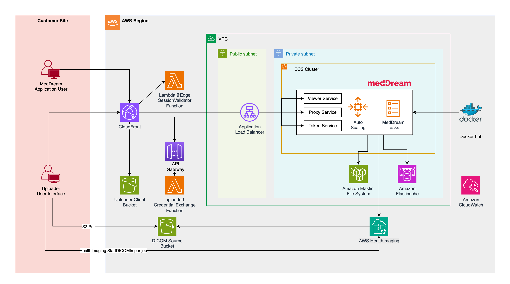

# AWS HealthImaging DICOM Viewer and Uploader

A secure, scalable solution for viewing and uploading DICOM medical images using MedDream viewer, AWS HealthImaging, and a custom React-based uploader interface.

This project provides a complete infrastructure for medical imaging workflows, combining AWS HealthImaging for DICOM image storage and management with MedDream's powerful viewer capabilities. The solution includes a custom uploader interface that enables secure, validated file uploads directly to AWS HealthImaging.

The system features serverless authentication, Redis-based session management, and CloudFront distribution for optimal performance. It supports multi-AZ deployment for high availability and includes comprehensive security controls through IAM roles and security groups.

## Architecture




## ⚠️READ this section if this project is intended to be used in production.

⚠️ This CDK project deploys the MedDream application behind Cloudfront using an HTTP connection to the MedDream application load balancer. This choice was made for the sake of easily testing the solution without complexities related to domain name and TLS certificate configurations. By default the communication between Cloudfront and the MedDream Application load-balancer results in the exchange of unencrypted data over the public network. 

If this project is intended to be used in production, makes sure that the project is reconfigured to use HTTPS between CloudFront and the Application load balancer :

1. Determine a valid domain name you have admin privileges for.
2. Generate a certificate for MedDream in the determined domain name.
3. Add an HTTPS listener to the ECS application load-balancer, and associate the certificate generated above.
4. Update your domain DNS registration wit the ECS load balancer hostname.
5. Update the origin representing the application load balancer in the MedDream CloudFront distribution to forward requests to the new load balancer endpoint over HTTPS. 


## Repository Structure
```
.
├── infrastructure/          # CDK infrastructure code
│   ├── bin/                 # CDK app entry point
│   ├── lambda/              # Lambda function implementations
│   │   ├── data-importer/   # Handles DICOM import jobs
│   │   ├── session-validator/ # Validates user sessions
│   │   └── validator-updater/ # Updates validator configurations
│   └── lib/                 # CDK stack definitions
├── uploader/                # React-based uploader application
    └── App/                 # React application source
        ├── app/             # Application components
        │   ├── routes/      # React Router routes
        │   └── Uploader/    # Uploader component implementation
        └── Dockerfile       # Container build definition
```


## Usage Instructions
### Prerequisites
- Node.js 18.x or later
- AWS CDK CLI
- AWS CLI configured with appropriate credentials
- Docker (for assets preparation before upload to AWS account)
- AWS Account with proper privileges to deploy CloudFormation stack
- AWS Account must be bootstrapped for CDK (required for deploying CDK apps)# Replace ACCOUNT-NUMBER and REGION with your values

### Installation Options

### Configuration Options

The deployment of the `uploader application` and  the `DICOM samples import` can be configured in `infrastructure/bin/cdk.ts`. You can enable or disable these optional components by modifying the stack configuration:

```typescript
// ********************************
// Deployment parameters
// ********************************   
const STACK_NAME = "meddream"; //Shoukd be unique for each deployment. Keep it less than 47 chars.
const ACCESS_LOGS_BUCKET_ARN = "";        // If provided, enables ALB access logs using the specified bucket ARN
const ENABLE_MULTI_AZ = false;            // If true, uses multi-AZ deployment for ECS
const ENABLE_VPC_FLOW_LOGS = false;       // If true, enables VPC flow logs to CloudWatch

const IMPORT_SAMPE_DATA = true;   //Controls if DICOM samples are loaded in the HealthImaging datastore during the deployment.
const DEPLOY_UPLOADER = true;     //controls if the DICOM data importer is deployed at https://[cloudfront_url]/uploader/ during the deployment.
```


### Installation

1. Clone the repository and install dependencies:
```bash
# Install root dependencies
npm install

# Install infrastructure dependencies
cd infrastructure
npm install
```

2. Deploy the infrastructure:
```bash
cdk deploy 
```

#### Uploader User Interface Installation.

The application is automatically compiled and deployed through the CloudFormation stack, assuming the setting `DEPLOY_UPLOADER` is set to `true` in the stack entry file `infrastructure/bin/cdk.ts`. This means:
- You don't need to manually build or deploy the React application
- When codes changes are made in `uploader/App`, the CloudFormation stack (via CodePipeline) handles:
  - Building the React application
  - Packaging the built assets
  - Deploying the application to AWS
  - Invalidation the CloudFront distribution, for the latest version of the application to be available to clients.

### Usage Quick Start

1. Access the DICOM viewer:
```
https://<cloudfront-distribution-domain>/
```
You can logon to the MedDream viewer application by navigating to the CloudFront domain name,using the `admin` password. Both the domain name and the admin user SecretsManager ARN are provided as output of the stack deployment. Eg:
```
[██████████████████████████████████████████████████████████] (72/12)

 ✅  meddream-1

✨  Deployment time: 2252.93s

Outputs:
meddream-1.AdminSecretArn = arn:aws:secretsmanager:us-east-1:040911247727:secret:meddream-1-MedDreamNestedStackMedDreamNestedStackResource61A723DF-7OPAY569SG8I-admin-credentials-3FVuib
meddream-1.CloudFrontDistributionUrl = d48qgdutncjba.cloudfront.net
Stack ARN:
arn:aws:cloudformation:us-east-1:040911247727:stack/meddream-1/2d858580-0eb5-11f0-99f6-0efab9cacd29

✨  Total time: 2261.1s
```

2. Upload DICOM files (If the Uplaoder was installed):
- Make sure that you are authenticated in the MedDream vewer first.
- In a new tab of the same browser, navigate to the uploader interface at `https://<cloudfront-distribution-domain>/uploader/index.html`
- Drag and drop DICOM files or select folders
- Click the  `Import to AWS HealthImaging` button, and monitor upload progress and status

## Development and Deployment

### Local Development
The uploader React application can be modified and tested locally. To work on the application:

1. Navigate to the uploader directory
2. Install dependencies: `npm install`
3. Run the development server: `npm run dev`
4. the local website will be access at `http://localhost:5173/uploader/`.
4. Make and test your changes locally


Key component interactions:
- CloudFront distribution handles request routing and caching
- API Gateway validates sessions through Lambda functions
- S3 provides temporary storage for uploaded DICOM files
- AWS HealthImaging manages DICOM data processing and storage
- Redis maintains session state and caching
- MedDream viewer retrieves and displays processed images
- Security groups and IAM roles control access between components

## Infrastructure

Below is a diagram of the AWS resources dependencies:


### Lambda Functions
- `data-importer`: Manages DICOM import jobs to AWS HealthImaging.
- `session-validator`: Validates user sessions and issues temporary credentials.
- `validator-updater`: Configures the session validator function configurations and CORS settings during the stack deployment.

### Storage
- S3 buckets for source and processed DICOM files.
- EFS for MedDream cache storage.
- Redis cluster for session management.
- AWS HealthImaging for DICOM data.

### Compute
- ECS Fargate for MedDream viewer.
- Lambda functions for serverless processing.
- CloudFront for content delivery.

### Networking
- VPC with public and private subnets.
- Security groups for access control.
- Application Load Balancer for MedDream viewer.
## AWS Resources

This project deploys the following resources types.

| Category | Resource Type | Purpose |
|----------|--------------|----------|
| **Compute** | Lambda Functions | - Data import processing for DICOM files<br>- Session validation<br>- Configuration updates |
| | ECS Fargate | Runs MedDream viewer containers |
| **Storage** | S3 Buckets | - Source DICOM file storage<br>- Processed image storage |
| | EFS | MedDream viewer cache storage |
| | ElastiCache (Redis) | Session management and caching |
| **Networking** | VPC | Network isolation and security |
| | Public Subnets | External-facing resources |
| | Private Subnets | Internal resources |
| | Security Groups | Network access control |
| | Application Load Balancer | Load balancing for MedDream viewer |
| | CloudFront | Content delivery and request routing |
| **Security** | IAM Roles | Service permissions |
| | IAM Policies | Resource access control |
| **Data Repository** | AWS HealthImaging | DICOM image management |
| **API** | API Gateway | RESTful API endpoints |
| **Monitoring** | CloudWatch | Logging and monitoring |
| **CI/CD** | CloudFormation | Infrastructure as Code deployment |
| | CodePipeline | Automated deployment pipeline |
| | CodeBuild | Build and test automation |
| | CodeDeploy | Application deployment automation |
| | S3 Artifact Bucket | Pipeline artifact storage |
