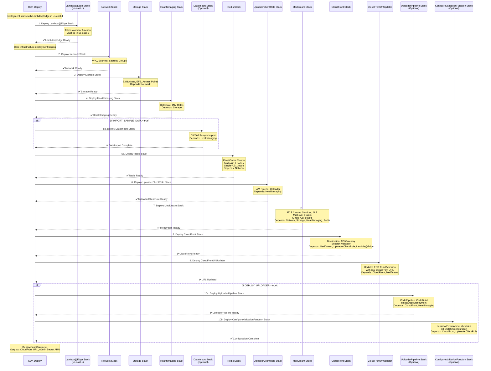

# CDK Stack Deployment Sequence Diagram

## Deployment Dependencies

### Core Dependencies (Always Deployed)
1. **Lambda@Edge Stack** → No dependencies (us-east-1)
2. **Network Stack** → No dependencies
3. **Storage Stack** → Network Stack
4. **HealthImaging Stack** → Storage Stack
5. **Redis Stack** → Network Stack
6. **UploaderClientRole Stack** → HealthImaging Stack
7. **MedDream Stack** → Network, Storage, HealthImaging, Redis Stacks
8. **CloudFront Stack** → MedDream, UploaderClientRole, Lambda@Edge Stacks
9. **CloudFrontUrlUpdater** → CloudFront, MedDream Stacks

### Optional Dependencies (Conditional)
- **DataImport Stack** → HealthImaging Stack (if `IMPORT_SAMPLE_DATA = true`)
- **UploaderPipeline Stack** → CloudFront, HealthImaging Stacks (if `DEPLOY_UPLOADER = true`)
- **ConfigureValidationFunction Stack** → CloudFront, UploaderClientRole Stacks (if `DEPLOY_UPLOADER = true`)

## Multi-AZ Impact on Deployment

### Single-AZ Mode (`ENABLE_MULTI_AZ = false`)
- **Redis Stack**: 1 node (primary only)
- **MedDream Stack**: 3 ECS tasks (1 per service)
- **Storage Stack**: No EFS automatic backups

### Multi-AZ Mode (`ENABLE_MULTI_AZ = true`)
- **Redis Stack**: 2 nodes (primary + replica)
- **MedDream Stack**: 6 ECS tasks (2 per service across AZs)
- **Storage Stack**: EFS automatic backups enabled

## Deployment Time Estimates

| Stack | Estimated Time | Notes |
|-------|---------------|-------|
| Lambda@Edge | 1-2 minutes | Simple Lambda function |
| Network | 2-3 minutes | VPC and security groups |
| Storage | 3-5 minutes | EFS creation takes time |
| HealthImaging | 1-2 minutes | Datastore creation |
| DataImport | 5-10 minutes | DICOM processing (optional) |
| Redis | 10-15 minutes | ElastiCache cluster creation |
| UploaderClientRole | 1 minute | IAM role creation |
| MedDream | 5-10 minutes | ECS service startup |
| CloudFront | 10-15 minutes | Distribution propagation |
| CloudFrontUrlUpdater | 1-2 minutes | Task definition update |
| UploaderPipeline | 3-5 minutes | CodePipeline setup (optional) |
| ConfigureValidationFunction | 1-2 minutes | Lambda configuration (optional) |

**Total Deployment Time**: 25-35 minutes (with optional components)
